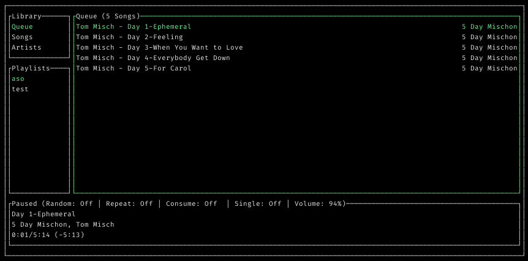

# peridot

A modern terminal MPD (Music Player Daemon) client

## Installation

### Dependencies

- `libmpdclient`
- `termbox`
- `crystal`
- `shards`

### From Source

1. Install the dependencies from you package manager
2. `cd` into the directory and run `shards install`
3. run `shards build --release`
4. The binary will be in the `bin/` directory link it to either `$HOME/.local/bin` or `/usr/local/bin`

## Usage

### Launching
Run the command `peridot`

### Keybindings
- "play the selection": "enter"*
- "add the selection to list": "space"*
- "quit": "q"
- "focus_primary_window": "1"
- "focus_library_window": "2"
- "focus_playlist_window": "3"
- "move_down": "j"
- "move_up": "k"
- "previous": "<"
- "next": ">"
- "toggle_pause": "p"
- "stop": "s"
- "toggle_repeat": "r"
- "toggle_random": "z"
- "toggle_single": "y"
- "toggle_consume": "R"
- "volume_up": "+"
- "volume_down": "-"
- "seek_forward": "f"
- "seek_backward": "b"
- "queue_remove": "D"
- "queue_clear": "c"
- "filter": "l" # Drills down into the directory
- "unfilter": "h" # Goes up the directory structure

\*currently these cannot be remapped

## Development

Install the dependencies and run `shards install`

## Contributing

1. Fork it (<https://github.com/travonted/peridot/fork>)
2. Create your feature branch (`git checkout -b my-new-feature`)
3. Commit your changes (`git commit -am 'Add some feature'`)
4. Push to the branch (`git push origin my-new-feature`)
5. Create a new Pull Request

## Contributors

- [@TravonteD](https://github.com/travonted) - Creator and Maintainer
